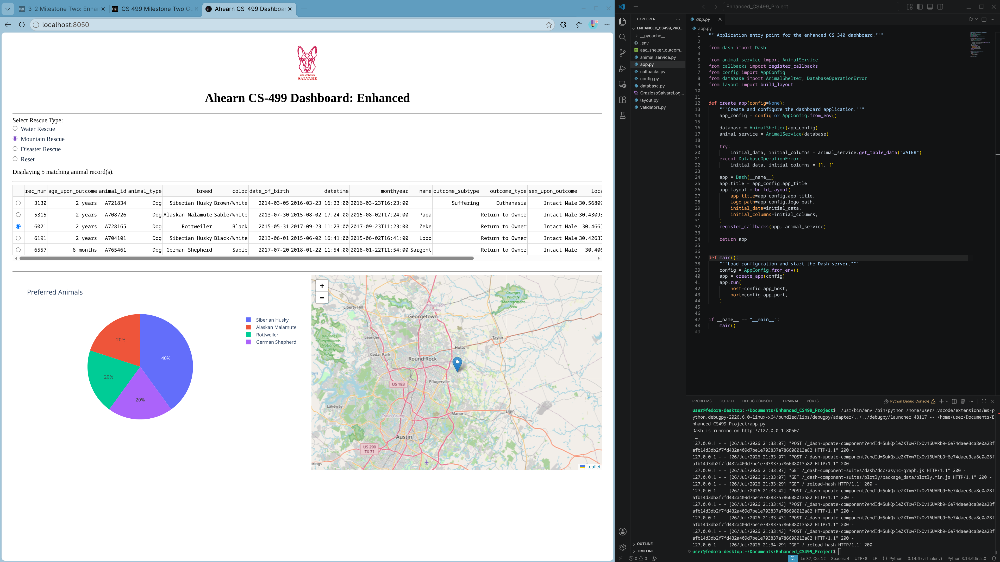

# Category One: Software Engineering and Design

I chose this artifact for my software design category because it represents several areas of computer science that I have studied, including software development, client/server applications, databases, user interface design, and secure coding. It gave me a good opportunity to show that I can do more than create a program that simply works. I can evaluate an existing application, identify weaknesses in its design, and improve it using better software engineering practices. The original project demonstrated that I could connect Python to MongoDB, retrieve records, filter data, and display results. However, the project was cumbersome to maintain because many unrelated responsibilities were joined in the same file. If there needed to be changes to the layout, database settings, or filtering behavior it would have had to be done in the existing two files since modularity was not apart of its original design.

The main improvement I made was reorganizing the project into a modular design. I separated the application into seven files: app.py, layout.py, callbacks.py, animal_service.py,database.py, validators.py, and config.py. Each file now has a defined purpose, for example, the layout file controls the user interface, the callback file handles user interactions, the animal service contains the rescue-filtering rules, and the database file manages MongoDB operations. This separation makes the application easier to understand, debug, test, and expand. I also moved the MongoDB password and other settings out of the main source code and into environment variables. This was a large pain point of mine and improved security because the credentials no longer needs to be stored directly in the program. Other improvements included stronger input validation, clearer error messages, application logging, safer update and delete operations, and better handling of missing records, images, or coordinates.

The end result is an improved version shown running locally on my machine. The original project ran on a Jupyter notebook so the database and original files had to be migrated over to run locally. 

