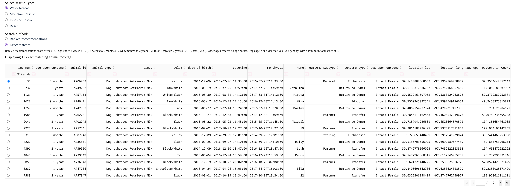
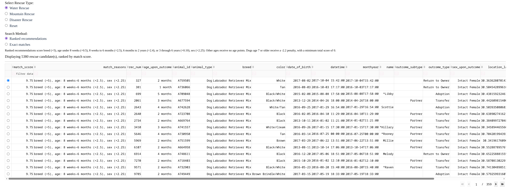
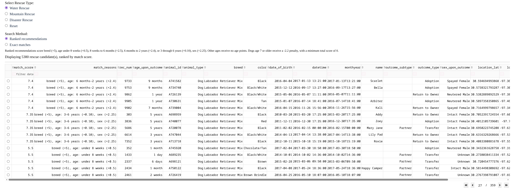
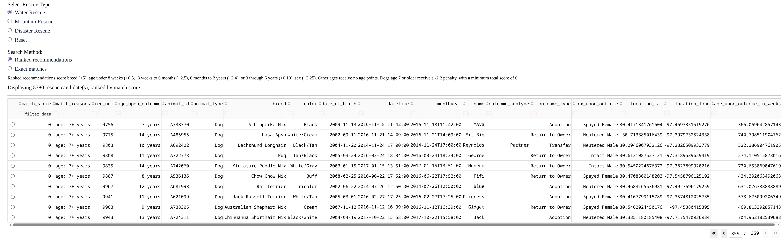

# Enhancement Two: Algorithms and Data Structures

The main improvement I made to this enhancement was developing a ranked matching system. This matching system far out-competes the original basic query filtering from the original CS340 artifact because it creates a score from each of the dogs attributes and ranks the best matching dogs from the best performing attributes to the least performing attributes. I created a ranking system reusing the attributes from the original rescue filters which prioritized preferred breed, age, and sex, while also adding weights for attributes outside this range including newborns (0-8 weeks), puppies (8 weeks- 6 months), adolescent (6 months-2 years), adults (3-6 years), and seniors (+7 years). Puppies impose the highest weight in the age ranges for their ability to be trained the most effectively. Seniors impose a negative weight due to their age and difficulty in training.

The biggest challenge I faced was finding the most optimal weights for the ranked based sorting algorithm. After researching the most optimal dog rescue ages, filtering out unsuitable outcome types, and playing with the weights I eventually found the best balance between the highest ranked dogs, lowest ranked dogs, and anything in between. Here are some screenshots that showcase different rankings based off the new algorithm and original.

Exact match from original project:

Best matches from new algorithm:

Mid matches from new algorithm:

Worst matches from new algorithm:

I believe this enhancement met the course outcomes I originally planned to address, outcome three. This enhancement demonstrated my ability to design and evaluate computing solutions that solve a given problem using algorithmic principles and computer science practices and standards appropriate to its solution, while managing the trade-offs involved in design choices. It demonstrates the use of algorithms to create an effective search filter for finding the best candidate dogs for rescue missions.
